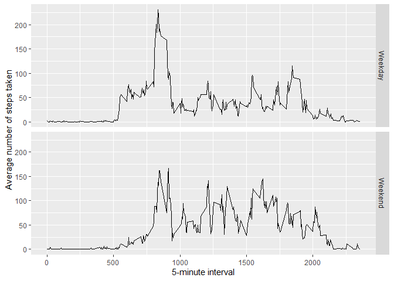

## Loading and preprocessing the data


```r
unzip(zipfile="activity.zip")
data <- read.csv("activity.csv")
```


## What is mean total number of steps taken per day?

1. Calculate the total number of steps taken per day


```r
library(ggplot2)
```

```
## Warning: package 'ggplot2' was built under R version 3.6.3
```

```r
totalSteps <- tapply(data$steps, data$date, sum, na.rm = TRUE)
qplot(totalSteps, binwidth=1000, xlab="Total number of steps taken each day")
```

<!-- -->

3. Calculate and report the mean and median of the total number of steps taken per day


```r
mean(totalSteps, na.rm=TRUE)
```

```
## [1] 9354.23
```

```r
median(totalSteps, na.rm=TRUE)
```

```
## [1] 10395
```


## What is the average daily activity pattern?

1. Make a time series plot (i.e. type = "l") of the 5-minute interval (x-axis) and the average number of steps taken, averaged across all days (y-axis)


```r
library(ggplot2)
avg <- aggregate(x=list(steps=data$steps), by=list(interval=data$interval),
                      mean, na.rm=TRUE)
ggplot(data=avg, aes(x=interval, y=steps)) +
    geom_line() +
    xlab("5-minute interval") +
    ylab("Average number of steps taken")
```

<!-- -->


2. Which 5-minute interval, on average across all the days in the dataset, contains the maximum number of steps?


```r
avg[which.max(avg$steps),]
```

```
##     interval    steps
## 104      835 206.1698
```


## Imputing missing values

1. Calculate and report the total number of missing values in the dataset (i.e. the total number of rows with NAs)


```r
missing <- is.na(data$steps)
# How many missing
table(missing)
```

```
## missing
## FALSE  TRUE 
## 15264  2304
```

2. Using the mean value for that 5-minute interval to fill the missing values

3. Create a new dataset that is equal to the original dataset but with the missing data filled in.


```r
# Replace each missing value with the mean value of its 5-minute interval
fillNA <- function(steps, interval) {
    finalSteps <- NA
    if (!is.na(steps))
        finalSteps <- c(steps)
    else
        finalSteps <- (avg[avg$interval==interval, "steps"])
    return(finalSteps)
}
newData <- data
newData$steps <- mapply(fillNA, newData$steps, newData$interval)
```

4. Make a histogram of the total number of steps taken each day and Calculate and report the mean and median total number of steps taken per day. 

```r
totalSteps <- tapply(newData$steps, newData$date, FUN=sum)
qplot(totalSteps, binwidth=1000, xlab="total number of steps taken each day")
```

<!-- -->

```r
mean(totalSteps)
```

```
## [1] 10766.19
```

```r
median(totalSteps)
```

```
## [1] 10766.19
```

Do these values differ from the estimates from the first part of the assignment? What is the impact of imputing missing data on the estimates of the total daily number of steps?


Mean and median values increases after imputing missing data. 

For the first part, for 'NA' the value is set to 0 by default which bring down the Mean and median values.


## Are there differences in activity patterns between weekdays and weekends?

Create a new factor variable in the dataset with two levels – “weekday” and “weekend” indicating whether a given date is a weekday or weekend day.


```r
dayCheck <- function(date) {
    day <- weekdays(date)
    if (day %in% c("Monday", "Tuesday", "Wednesday", "Thursday", "Friday"))
        return("Weekday")
    else if (day %in% c("Saturday", "Sunday"))
        return("Weekend")
    else
        stop("Invalid date")
}
newData$date <- as.Date(newData$date)
newData$day <- sapply(newData$date, FUN=dayCheck)
```

Make a panel plot containing a time series plot (i.e. type = "l") of the 5-minute interval (x-axis) and the average number of steps taken, averaged across all weekday days or weekend days (y-axis). 


```r
avg <- aggregate(steps ~ interval + day, data=newData, mean)
ggplot(avg, aes(interval, steps)) + geom_line() + facet_grid(day ~ .) +
    xlab("5-minute interval") + ylab("Average number of steps taken")
```

<!-- -->
